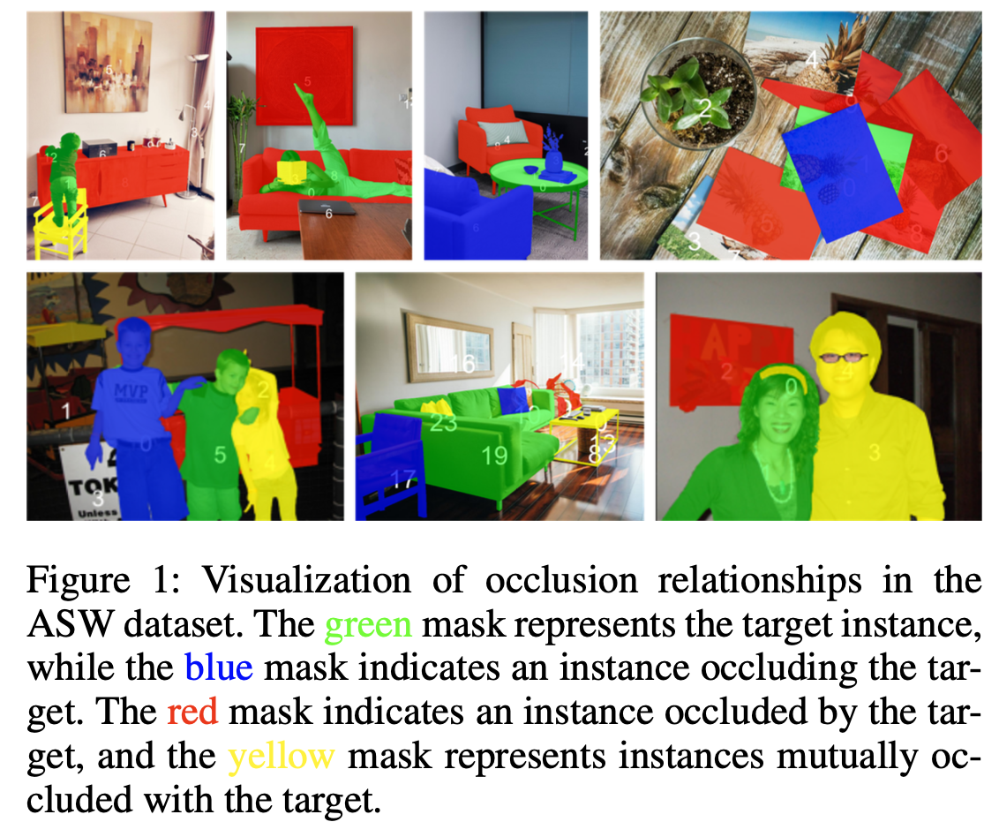

# Adobe's Amodal Scene in the Wild (ASW) dataset


This repository provides image download link and mask annotations for the Amodal Scene in the Wild (ASW) dataset as described in the AAAI2024 paper:

#### Amodal Scene Analysis via Holistic Occlusion Relation Inference and Generative Mask Completion
Bowen Zhang, Qing Liu, Jianming Zhang, Yilin Wang, Akide Liu, Zhe Lin, Yifan Liu

## Download image and annotation files
The 2,000 images in the evaluation set of ASW could be downloaded [here](https://drive.google.com/file/d/1dnSRr1b1ceYjRaIsPpRW_QbOMF-C8v-t/view?usp=sharing). Their annotations, which include 14,969 high-quality amodal masks with occlusion ordering, could be found in the `val_image_anno.json`. To use the dataset, `data_visualization.ipynb` provides an example.

## Citation
Please cite our AAAI2024 paper if you use the ASW dataset in your work.
````
@InProceedings{Zhang_2024_Amodal,
    author    = {Zhang, Bowen and Liu, Qing and Zhang, Jianming and Wang, Yilin and Liu, Akide and Lin, Zhe and Liu, Yifan},
    title     = {Amodal Scene Analysis via Holistic Occlusion Relation Inference and Generative Mask Completion},
    booktitle = {AAAI},
    year      = {2024},
}
````

## License
This dataset is released under [Adobe Research License](LICENSE.md). The license prohibits commercial use and allows for non-commercial research use.